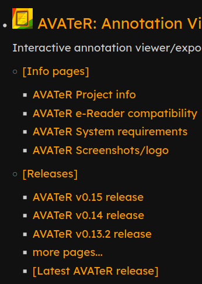
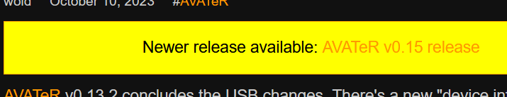
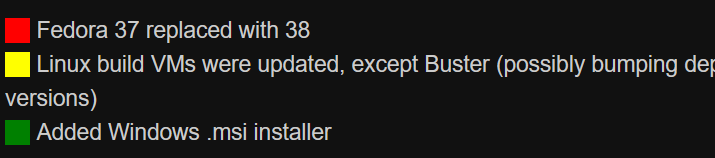

+++
title = "Macros and templates for Zola"
description = "Macros and templates used on syncoda.nl"
weight = 1
draft = false
date=2024-03-18


[taxonomies]
tags = ["Zola"]

[extra]
toc = true
series = "Zola"
+++

The macros used on this website (Syncoda.nl) are briefly presented. You may considering skipping this for the articles listed in the 'Series' menu. 


Note:
- shorter macros are included - latest versions and others can be accessed via [github](https://github.com/wold5/syncoda/). These are included here for demonstrative/learning purposes. For a '80s BASIC vibe, type them over manually ;)
- indentation is used: this can be problematic with templates, for macros with whitespace control, this matters less
- sometimes inline CSS is used, prioritizing portability and re-use. Visual styling aims to be solely functional and universal
- translation support will be improved halfway 2024

## Templates

### page_software_release.html
Software release page, offering a:
- changelog (loading changelog.txt)
- requirements (loading requirents.txt)
- release remarks
- download menu list (macro that utilises `page.assets`). 
which depend on various macros.

An example is the [AVATeR v0.15 release page](/software/avater/releases/0.15/).

### section_redirect_to _parent_firstpage.html
Subsection, that redirects to the first ordered page for its parent section. Allows creating a `/project/releases/latest/` that redirects to, say, `/project/releases/v0.16/`. 

- Why a subsection? It can access its parent section(s) using `{{ section.ancestors }}`; its direct parent being `{{ section.ancestors | last }}`. This avoids hardcoding a section path.
- The redirection page was modelled after Zola's redirection page (`internal/alias.html`).

```Jinja2



<!doctype html>
<header>
<meta charset="utf-8">
<link rel="canonical" href="{{ redirect_url | safe }}">
<link rel="stylesheet" href="/abridge.css" /><!-- manually specified, no base URL -->
<meta http-equiv="refresh" content="0; url={{ redirect_url | safe }}">
<title>Redirect to latest</title>
</header>
<body>
<p><a href="{{ redirect_url | safe }}">Click here</a> to be redirected to the latest release.</p>
</body>
```

### section_subsections.html
Section template that renders a tree with pages and subsections and their pages, etc. 

- Used on the [software index](/software/) and its child sections, like [/software/avater/releases/](/software/avater/releases/)
- Upon reaching `maxdepth`, a `[[[more sections...]]]` link is provided. 
When subsections also use this template, ongoing navigation is allowed to any depth.

_! Note the macro currently only supports the site main language._

## Macros: navigation related


### Get a page its parent section
- `macro get_page_parent_section_path(path)`

Get a page its parent section path, for use with get_section()

- ! does not yet handle translations

```Jinja2

	
{{- section_parent_dir ~ '/_index.md' -}}

```

### List section pages upto x
- `macro list_section_pages(section_object, pagelimit=-1)`

Get a section its pages, and output each within `<li>` tags (no `<ul>`)

- Upon reaching pagelimit, output a "More..." link to the section.
- Used for the [software section release index listing](/software/).

```jinja2

	
	
		{#- Avoid a if/while <= loop, as unlimited range then requires some max value -#}
		
			<li><a href="{{ p.permalink | safe }}">{{ p.title | default(value="Page") }}</a></li>
			
		
			<li><a href="{{ section_object.permalink | safe }}">more pages...</a></li>
			
		
	

```

### Page and section index
- `macro create_index(sectionobject, depth=0, maxdepth=5)`

Large recursive function that builds a menu tree with pages and (sub)sections. Can be used for section indexes, like:



- page count can be limited per section, outputs a 'more...' link to that section
- upon reaching `maxdepth`, outputs a '[More sections...]' link to that section.

Used for the [software section index](/software/).


### Get first page path for a section
- `macro get_section_first_page_path(sectionpath=parent_section)`

Get a section its first ordered page path(!), not the object.
- Assumes the original sorting suffices.
- Use `| trim_start_matches(pat="/")` to remove any leading slashes

```Jinja2

	
	
		{{ p.path }}
		
			
		
	

```


## Macros: software release related


### Compare latest version

- `macro check_latest_version(page_path)`

Compares the current page path to that of the 'latest' version, being the parent section's first sorted page. If dissimilar, returns a link to the newer release page. 



- Alternatively, do the comparison using some `page.extra.version` variable.

```Jinja2

	
	
	
		
	<a href="{{ newest_page_object.permalink }}">{{ newest_page_object.title }}</a>
	

```

Example template use:

```Jinja2


<p style="padding: 5px; border: solid 1px orange; background-color: yellow; color: black; text-align: center;">
Newer release available: {{ newer_version | safe }}
</p>

```

### Release remarks

- `macro print_download_remarks(remark="", spacer="")`

Converts an array into colour-coded remarks/warnings: useful as users can't be expected to compare all release notes.



Remarks are stored in the frontmatter using an array of arrays, like:
```
[extra]
remarks = [[1, "Windows EXE installer has been deprecated in favour of the MSI installer."],[0, "added Windows Qt5 release"]]
```

- Current output colour-codes are: 0=none/green; 1=low/yellow; 2=high/red
- Dictionary keys can't be referenced currently (v0.17), so use array offsets.
- The default 'no remarks' condition can be setup in various ways. Using a default array argument doesn't work yet.

```Jinja2

	<span style="margin-right: 5px; padding: 0px 10px; background-color: greenyellowred">{{- spacer | safe -}}</span> {{- remark[1] }}<br>

```

Example usage being:
```Jinja2



	{{ syncoda_macros::print_download_remarks(remark=[0,"No requirements have changed"]) }}

<p>

	{{ syncoda_macros::print_download_remarks(remark=r) }}

</p>

```

### Generating pretty download links

- `macro filename2platform(path)`

- `macro assets2downloads(page, gethashes=true, include_matches="", exclude_matches=".png$|.jp[e]?g$|.gif$|.txt$|.pdf$|.bmp$|.mp4$")`

- `macro filelink_decoration(asset, filename, gethashes=true)`

This [topic is discussed here separately](/posts/zola_tips/prettifying_downloadlinks/) (or see the series menu), where alternative versions are discussed that might be preferable.

The macro `filename2platform` matches a filepath to a OS/platform. Next, `assets2downloads` generates a pretty menu. Lastly `filelink_decoration` creates a link + hash. As for sha256 hashes, large projects might consider alternative (cached) calculation methods.
