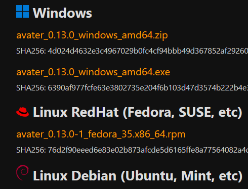
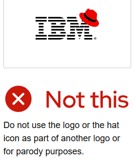

+++
title = "Prettifying software package downloadlinks with Zola and Jinja2/Tera templates"
draft = false
weight = 5
date=2024-03-26

[taxonomies]
tags = ["website", "Zola"]

[extra]
toc = true
series = "Zola"
+++

Explored is improving the presentation of downloadlinks on this website, providing (non-technical) users with an easy overview of software releases per OS/platform.

A few approaches for grouping packages by OS/platform are discussed, with two simple scripting approaches being presented that utilise the filepath for OS identification. While fragile, this parsing approach will often be sufficient for small projects, avoiding extensive build-system integration.

<!-- more -->

An example implementation being (disregard the graphical design for now):




## Approaches, goals and constraints

1. Manually place downloadlinks (copy 'n paste)
2. Parse the filename/path of each package
3. Process some package manifest with details on each package.

For this website, some automation was desired without over-engineering a solution, suggesting approach #2. Approach #3 would be the 'professional' approach, providing more control and avoiding parsing filepaths (fragile, even flaky) - however, when sorting files into platform-specific subdirectories, approach #2 again suffices. 

## 1. Using manually placed links
Don't outright dismiss manually placing (copy-pasting) links: the description can be easily changed, and with consistent filenames only the version number needs updating. A variation could even use scripting to insert a `page.app_version` number (but not in the frontmatter, unless generating that externally, but I digress). This setup is fragile in the long run (when files are moved around), but can be sufficient.

```
[Windows 8-11 release (64-bit)](/static/files/project/releases/...v0.11...exe)
```

## 2. Parsing the filepath of page assets
If desiring automation, determining the OS/platform is a first step: parsing the filepath then offers an attractive shortcut. Some example package filenames are shown below (in order: Fedora, Debian and Windows):
```
avater-0.11.0-1.x86_64.rpm
avater_0.11.0-1_amd64-buster.deb
avater_0.11.0-1_amd64-bullseye.deb
avater-0.11.0-win64.exe
avater-0.11.0-win64.zip
```

Notice that when sorted, the filenames group by platform: while not guaranteed, this can be helped somewhat... which will prove useful later. Using parent directories like `/windows/` simplifies the issue even more. 

### Filepath component considerations

When parsing one can utilize the parent directories, filename stem, extension or a mix of these. Discussing these involves some common knowledge, but let's walk through it, or fast forward to the [scripts](#basic-scripting-implementation).

#### Path or subdirectories
The path will usually lack OS related information, unless packages are pre-sorting packages into subdirectories like `/windows/`. The latter also simplifies path scripting considerably, but this still leaves _the initial sorting task_, to be done manually, by the build system (ideally) or some external script. \
And even if the path suffices, it can be argued that a downloaded file ought to be still identifiable as to the platform, etc..

_Note a SSG must also support iterating through subdirectories; Zola currently does so for co-located assets. Even if not, adding this should be doable._

#### File extension
Package file extensions tend to be unique to each OS/platform, with some overlap. Platform-agnostic examples are Flatpack and Snap; generic ones `.run` and `.sh` for Linux, and `.pkg` as used by all BSDs. Consider also archives like `.tar.bz` or `.zip`. Re-compressed packages could be assigned `.exe.zip` to remain 'recognisable'. 

The exceptions suggest that one ought to complement the extension with some OS/platform identifier in the filename stem (see also the note regarding subdirectories above).

#### Filename stem
The package stem doesn't always contain platform identifiers (e.g. "windows", "fedora"). For the CPack packaging system only Windows has `win64` (or `win32`) by default, requiring further configuration (an appendix briefly discusses editing CPack package filenames).

Modifying the file stem may not always be desirable. RPM and DEB based systems gravitate towards standard filename formats, geared at package repository _tools_. Even when ignored, compliance may still be needed in the future. For archives this matters less, as these are created outside a repository orientated workflow anyway.

##### Legacy files
Lastly, consider any legacy files. These may lack identifiers altogether: does one rename those? Or adapt the script? One option is to handle any legacy files transparently, using a fallback mode that just lists the files, say, if some version or date variable is below/before a certain value.

Let's now look at some basic scripting implementations.

### Basic scripting implementation 
The most flexible and KISS approach is to just repeatedly iterate `page.assets`, using regular expression matches. 

The matching can be done using multiple `for` loops, or (better) calls to a macro functions. While not pretty, it provides full layout control, including insertion of customized text like links to external repository links. 

```jinja2
<h3 id="downloads_debian"> Linux Debian (Ubuntu, Mint, etc)</h3>


	
		{{- syncoda_macros::filelink_decoration(asset=asset, filename=filename, gethashes=true) -}}
	

```

Where `filelink_decoration` is a macro that outputs the filename, link and hash.

Note:
- higher version numbers will be sorted below lower ones, so preferably use separate pages for each release (or use `page.assets | reverse`).

### Getting the OS/platform
The platform matching could be moved into a separate function, allowing re-use. One example macro is:

```jinja2

    
    {#- get platform: replace this part by a capture group -#}
    {#- match extension -#}
    
        
    
        
    
        
    {#- match filename -#}
    
        
    
        
    
        
    
        
    

	{{-platform-}}

```

Note that:
- a group capture can be emulated to some degree, by abusing [`trim_start_match()`](https://keats.github.io/tera/docs/#trim-start-matches) and friends, or [`split`](https://keats.github.io/tera/docs/#split)(), like: ``, or for subdirectories `(...) | first | lower`
- Returning a value from a macro may include spaces even with `{%-` and friends: optionally filter the assigned result with `trim`.
- When embedding such a loop, use `set_global` to preserve `platform` between iterations.

The modified script then becomes (don't forget the macro import), with an added file filter:

```jinja2
<h3 id="downloads_debian"> Linux Debian (Ubuntu, Mint, etc)</h3>


    
        
    

	

	
		{{- syncoda_macros::filelink_decoration(asset=asset, filename=filename, gethashes=true) -}}
	


```
We could do slightly better using a single iteration, as discussed next, though it comes with some limitations.

### Single iteration version
The single iteration version relies on (alphabetic) sorting to group the packages by platform: a fragile (read: bad) assumption, but it can be helped somewhat. If the assumption holds, we need only check for a new platform, and insert the associated platform text once at for a new one.

The presented function has an improved include/exclude filter, which could be split off into another macro. Ideally, we'd use some dictionary to store files by platforms, but we can't yet, so we have to make do with what we have:

```jinja2




    {# presents a lowercase filename #}
    

    {# include OR exclude files. Include takes priority #}
    
        
    
        
    

    {# get the filename lowercase. pat depends on platform #}
    

    {# identify platform. When using subdirectories, splitting on the first part suffices instead #}
    

    {# output platform label #}
    
        

        {# overrides #}
        
<h3 id="downloads_debian"> Linux Debian (Ubuntu, Mint, etc)</h3>
        
<h3 id="downloads_redhat"> Linux RedHat (Fedora, SUSE, etc)</h3>
        
<h3 id="downloads_macos"> MacOS</h3>
        
<h3 id="downloads_windows"> Windows</h3>
<p>For older Windows releases the Qt5 .zip version may work instead.</p>
        {# default #}
        
<h3 id="downloads_{{platform}}">{{platform | capitalize}}</h3>
        
    

{{- self::filelink_decoration(asset=asset, filename=filename, gethashes=true) -}}



```

Admittingly it compares somewhat unfavourably: efficient, yes, reasonably KISS, but it loses the layout control and has a sorting requirement. We could now though collect 'unidentified' files into an array, and handle those separately at the end (not implemented above). As noted, doing that per platform isn't possible, unless resorting to using hardcoded arrays for each platform: icky, but doable :)

Note that:
- the example only processes the filename (not subdirectories)
- the 'Other' category is best treated as a warning. As noted, these could be stored up in a array, and processed last
- external repository links pose a challenge here: 
    - for existing categories, place these under the headers
    - or insert these before/after
    - direct file links could be [appended](https://keats.github.io/tera/docs/#concat) to a copy of the `page.assets` array, to be sorted after and then processed as discussed (see also #3, next).

## 3. Processing manifests
The last approach is to use some manifest file, containing details on each package. A CSV or JSON manifest could be imported using [`load_data()`](https://www.getzola.org/documentation/templates/overview/#load-data), for processing or iteration. One could also import markdown or HTML, generated outside the SSG; or use 'load_data' with a literal JSON string, inserted into the page. 

We will only suggest some starting points: 
- get the build system to generate such a file, i.e. using CPack and [`CPACK_POST_BUILD_SCRIPTS`](https://c	make.org/cmake/help/latest/module/CPack.html#variable:CPACK_POST_BUILD_SCRIPTS). 
- use a OS/platforms packaging tools to query packages like DEB and RPM
- use a system like the [Open Build Service](https://openbuildservice.org/), which IIRC even generates downloadpages (for internal consumption)
- in 2024, we also _neeeed_ to mention AI as a magic wand of sorts ;)

## Appendices

### Broken downloadlinks due to URL slugification
Zola's slugification replaces URL dots by default, including version dots in filenames. To fix this, use the `safe` mode instead, as detailed on the [intro page](/posts/zola_tips/intro/#gotcha-version-numbers-and-safe-urls-slugification).

### Changing CPack package filenames
`RPM` and `DEB` generators use their own filename variables. While changeable, mind any (future) repository workflow requirements. Their CPack defaults are string literals like `DEB-DEFAULT` or `RPM-DEFAULT`, that trigger an internal condition (i.e. if replaced these must be fully defined). 

For the other CPack generators, like `archive` (ZIP), `NSIS` and MacOS (and perhaps others), modify the [`CPACK_PACKAGE_FILE_NAME`](https://cmake.org/cmake/help/v3.0/module/CPack.html#variable:CPACK_PACKAGE_FILE_NAME) string, before calling `include(CPack)`. It'll be some variation upon the following:
```
set(CPACK_PACKAGE_FILE_NAME "${PROJECT_NAME_LOWER}_${CPACK_PACKAGE_VERSION}_${CPACK_SYSTEM_NAME}_${PROCESSOR}_${DESCRIPTION}")
message(STATUS "package filename: ${CPACK_PACKAGE_FILE_NAME}")

```
The extension is added automatically. Note that:

- be mindfull when cross-compiling; some CMake variables do account for these situations, some don't.
- `description` here details the Linux distro: consider using a manually configured environment variable, set before compilation. Identifying a Linux distribution by script didn't appear that easy, the better examples looking in `/etc/` for distro-specific files. 


### Operating system logos
Ending on a lighter note: adding visual logos aid recognition, and liven up the page a bit. [Wikimedia commons](https://commons.wikimedia.org/) provides most icons in SVG format. Some may even consider stylized (gasp) logo variations. And lastly children, pay attention, you're not allowed to have fun with logos (the graphical kind ;-):




---

- First release: 2024-03-26
- Original: 2023-06-10 (then unreleased)
