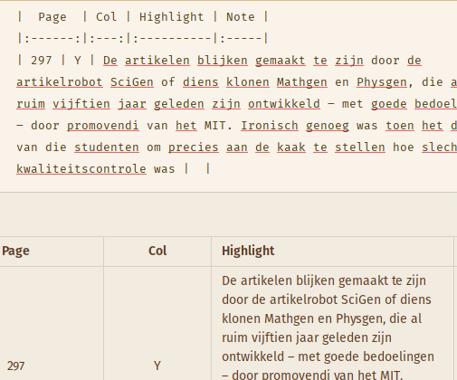

+++
title = "AVATeR v0.10 release"
date = 2022-08-31
weight = 0
aliases = ["/posts/2022/avater-release-0-10/"]
template = "page_software_release.html"

[taxonomies]
tags = ["AVATeR"]

[extra]
toc = true
remarks = [[0, "First public Fedora release"]]
application_name = "avater"
application_logo = "/images/logo-avater.png"
application_version = "0.10.0"

+++
[AVATeR](/software/avater/) v0.10 restores search settings on startup, adds Markdown export, and includes many fixes and optimisations after testing.

<!-- more -->

## Details

Read on for additional details.

### Changes
New are restoring the last search settings on startup, support for Markdown exporting, and showing deleted annotations, amongst others. 

Markdown export example: \

Deleted annotation above (after editing the highlight on the PocketBook reader):

The annotation viewer sorting and filter options were reworked and optimised, also allowing custom sorting using the headers. Adding new annotations after connecting a device saw some fixes[^1]. Also, profile support was implemented. While somewhat of a boondoggle, the associated changes improved the program's structure. Other fixes and improvements targeted the creation and removing of local mirrors, and adding and removing of USB devices.

New is a Fedora 35 binary release. An RPM package will follow at some point (for now manually install `libzip` and `qt5-qtbase`). Mentioning that: the Windows release size may vary somewhat. This is due to the ex/inclusion of two libraries, that strictly aren't needed (for backward OpenGL/DirectX compatibility).

Report any issues or feedback via `support [at] syncoda.nl` or the [mobilereads thread](https://www.mobileread.com/forums/showthread.php?t=345428).

## Future changes

Book metadata should ideally be retrieved from the main database. Some known but minor issues will be addressed, such as dealing with changes of a synced devices.conf. Another involves toggling case-sensitive sorting with non-latin characters in the title sort modes.

[^1]: (when encountering issues with the viewer refresh, toggle the "Reset viewer" option in settings under "Advanced"). As implied, this will recreate the viewer upon receiving updates.
