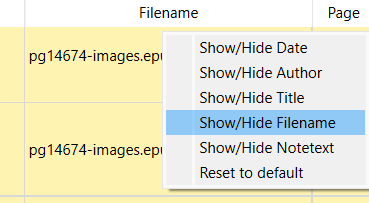
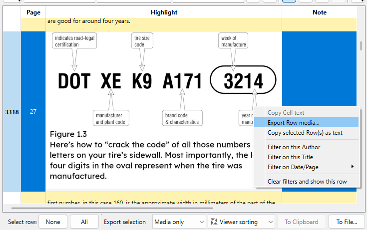
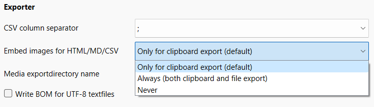

+++
title = "AVATeR v0.12 release"
date = 2023-01-12
weight = 0
aliases = ["/posts/2023/avater-release-0-12/"]
template = "page_software_release.html"

[taxonomies]
tags = ["AVATeR"]

[extra]
toc = true
screenshots = ["avater-screenshot-mediaExport.png"]

+++

[AVATeR](/software/avater/) v0.12 improves restoring the window position, adds support for annotation images (view/export), filenames, PB firmware 5.x and other improvements and fixes.

<!-- more -->

## Details

### Improved restoring window size and position

For laptop users with external screens: if AVATeR previously ran on a non-primary screen, and that screen was disconnected, it would reopen on the previous location, outside the visible workspace. Now the app will be moved into the visible workspace.

### Double clicking highlights in the viewer

After double clicking on a highlight in the viewer, line breaks are now properly shown (double clicking allows selecting part(s) of a highlight).

### Filename details

If a book has no (an empty) title, this is now indicated, together with the filename. Note the title sorting modes will ignore this replacement text (as it should be, I think).

In addition, a filename column was added to the viewer, hidden by default. Display it by right-clicking the viewer header, as shown below. This change required resetting the column widths once for v0.12 and higher.

Exported annotations now also include the filename, shown next to the title and author.

### Display image annotations

Note this concerns (partial) screenshot annotations made within e-books, not to be confused with full display screenshots.
Displayed image media are now resized to the highlight column width. Previously, only limited support was included.

Some quirks: 
- Windows displays that use a scale/zoom factor may show blocky images. This needs work.
- Scrolling past image rows increases their size by 1px at intervals (likely a rounding error). In practice this is a minor inconvenience, left in for now.

### Exporting Media

In the viewer, right-clicking a row with a media item, shows an "Export row media" option (see previous image), that write this row its media to selected directory.

Clipboard exports will embed any media (except for TXT), whereas the file export writes media to disk. Embedding can be toggled under "settings > annotation viewer" (see image below). To export only the media, use the new "Media only" export format.

Note the exporter is flexible in the type of media handled, and could handle audio annotations - it's unknown if such a feature was ever implemented for PB e-readers.

### Minor export changes

The CSV export now escapes linebreaks. The previous setup worked, but could be unpractical. Newly added are filename, media and annotation ID Hash (UUID) columns.

Optionally, a BOM identifier can be included with exported files (see settings). While not required, this can improve text encoding detection with some applications, preventing display issues.

### Added PocketBook HD/HD2 support (firmware 5.x)

These units utilized different USB IDs. A minor fix improved firmware 5.x compatibility.
