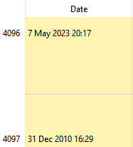

+++
title = "AVATeR v0.13.1 release"
date = 2023-06-17
weight = 0
template = "page_software_release.html"

[taxonomies]
tags = ["AVATeR"]

[extra]
toc = true
screenshots = ["avater-screenshot-0.13.1-1.png"]
remarks = [[2, "Changed: Windows releases requires Win10/11"],[1,"New Qt6-only releases for Linux"]]

+++
[AVATeR](/software/avater/pages/info) v0.13.1 adds Debian 12 / Fedora 37 releases using Qt6. Windows moved to Qt6.5.1, fixing possible issues with Windows 11. 

In addition, a new sorting mode using the annotation ID (in order of addition) was added, together with some fixes.

<!-- more -->

## Details

Read on for additional details.

###  Linux additional Qt6 releases
There are additional releases for Redhat/Fedora 37 and Debian 12 (Bookworm ~ Ubuntu 22+), that both use Qt6.

We don't expect much changes from Qt6 as we use QWidgets, mainly better high DPI display support, and the odd bug fix. Internally, one relevant change was Qt6.5 revising the meta type system: we use it sparingly however. Qt5 backward compatibility will be kept for now, supporting older distros.

###  Windows Qt6.5.1; 0x0000005c exception
Windows releases have moved to Qt v6.5.1, dropping Windows 7/8 support. 

The update might solve a issue where Windows 11 refuses to start previous AVATeR releases. A few technical details: Windows logs indicate a generic `0x0000005c` exception error, caused by the Qt `QtWidgets.dll` library. We'll assume this is a compatibility issue, perhaps a non-recurring one. By chance, v0.13 skipped the update due to a 6.5 packaging glitch (by Qt, but we can't complain).

### Sort on ID mode added + date fixes

Forgetting to set the e-reader's date and time, resulted in a bunch of misdated annotations. AVATeR will eventuelly get to modify the DB dates - it prompted a few changes to improve the situation:

- a new sortmode using the note's ID, listing annotations in order of addition. It is the default now.
- annotations older than the first annotation are shown now. Previously these were filtered out, a side-effect of limiting the UI date filter range for user convencience.
- a localmirror database can now be overwritten by a device database with an older timestamp. \
As the device database filetimestamp also gets changed, updates were prevented (a recently change allowed this, but didn't adjust filecopy settings). Since the localmirror is just that, a mirror, this shouldn't pose any issues. 

Time travellers may rejoice - just don't forget to pack your e-reader along with your towel[^1].

## Next release

There will be a few more internal changes for 0.13.2.

[^1]: on a related note... would actual, the 'impossible' kind, [time travel be instantious? [quora.com]](https://www.quora.com/If-time-travel-were-possible-would-it-be-instantaneous-Or-would-it-somehow-be-limited-by-the-speed-of-light) And that's excluding the time dilation variant ;)
