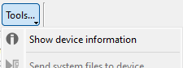
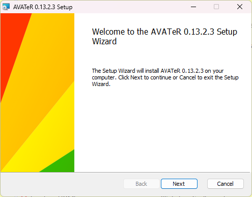

+++
title = "AVATeR v0.13.2 release"
date = 2023-10-10
weight = 0
draft = false
template = "page_software_release.html"

[taxonomies]
tags = ["AVATeR"]

[extra]
toc = true
screenshots = ["avater-screenshot-0.13.2-1.png"]
remarks = [[2, "Fedora 37 replaced with 38"],[1,"Linux build VMs were updated, except Buster (possibly bumping dependency versions)"], [0,"Added Windows .msi installer"]]

+++
[AVATeR](/software/avater/) v0.13.2 concludes the USB changes. There's a new "device information" panel; MSI installer; the VirtualCD compatibility issue was fixed; Kobo and Sony readers are now detected (annotation support will follow in v0.14) - testing is welcome; and various smaller changes.

<!-- more -->

## Details

Read on for additional details.

### Device information panel

Details about an e-reader, its storage drives and databases are now listed by the "Device Information" window in the tool menu. It's fully text based, so nothing exciting.

### Kobo and Sony detection, tool support
Kobo and Sony readers are now detected and shown in the device list - annotation support will arrive in the upcoming v0.14 release. Testing is welcome. Note for Sony's readers that after granting file access on the e-reader screen (Sony) a manual device re-scan may be needed (use the scan button or F5); this may be fixed later.

The manual backup tool and uploader now supports Kobo readers, but this too is early days. The uploader can copy fonts and dictionaries. For Sony readers some additional changes are required coming with v0.14.

###  Windows MSI installer + changes

A new Windows `.msi` installer was added. MSI lacks the known security risks of `.exe` installers, and are easier for managed installations (use `ACCEPT=YES` to accept the license).

Note the MSI installer currently allows only one (MSI) installed version: any previous MSI-installed version will be uninstalled; the binary isn't signed; and is CPack/Wix 3 based.

###  Windows EXE install location changed

The `.exe` will now by default install to the program directory `AVATeR`. This can be manually changed during installation.

###   USB device detection/handling changes

The main changes involved reworking the Windows USB related functions, and retrieving storage related details (disk size, etc) and storing these. 

Windows functions were reorganized: in the early days, one large function was used (being happy it worked), that was eventually split up (+-0.9.8), but that could still be improved upon. Expect a minor speed-up as well.

These changes also work towards open sourcing this part, though this is still low priority.

###  Windows VirtualCD compatibility fixed

Manually adjusting the VirtualCD driveletters shouldn't be necessary any more.

###  Linux build systems updated
Linux build VMs were updated, with exception of Debian Buster. This might bump some dependency versions, which may affect other distro's. If there are any issues, let us know.

###  Fedora 38 replaces 37
The Fedora 37 build was replaced with 38, due to VM issues. 35 will be kept for now.

## Next release

The next v0.14 release adds Kobo annotation support, and perhaps also Sony support. While Sony readers aren't a priority, supporting a diverse set of readers will improve the program design - ideally. It seems however doable while keeping things simple (Frankly, I had to keep myself from doing this already, needing to finish the USB parts first ;)).

For Linux Wayland (i.e. Fedora 37/38) pop-up dialog windows are not centered properly; this is due to Wayland and is a known issue with Qt. This remains to be investigated.

On the long term, adding CLI interaction is considered. As is allowing manual selection of a device directory; this was explored (re VirtualCD), and would allow accessing network mounted devices. These will land eventually in a future release.
