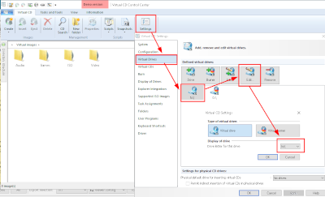

+++
title = "AVATeR v0.13 release"
date = 2023-05-05
weight = 0
aliases = ["/posts/2023/avater-release-0-13/"]
template = "page_software_release.html"

[taxonomies]
tags = ["AVATeR"]

[extra]
toc = true
screenshots = ["avater-screenshot-0.13-1.png"]

+++
[AVATeR](/software/avater/) v0.13 mainly features reworked device handling, adding unmounted device support amongst others.

<!-- more -->

The folkore regarding the number '13' suggested an opportunity for reworking some of AVATeR internal parts. Device support was improved, and the source code got into a better state - at the risk of introducing new bugs. The release was delayed a number of times to implement things properly, avoiding the worst problems. For v0.14.x the focus will be again on annotation support (see the header "Future Changes" below).

## Details

Read on for additional details.

### Unmounted device support
Reported device storages may now be (partially or fully) unmounted. Should you mount a device after detection, use the device scan (F5) to pick up on those changes. We'll look into mounting devices, provided there are easy (API) ways to do so: we won't ask for user credentials.

New icons replace the "is connected" text. A circle indicates a LocalMirror, a square a device with optional SD-card. Unmounted devices are indicated using light grey. A statusbar indication may be added as well later. 

### Ignore 2nd device arrival
In certain situations PBs send a 2nd USB arrival signal. This signal is now ignored for the last detected (compatible) reader. The threshold is 6 seconds by default, and is user-configurable via settings > advanced. 

### Incompatibility with VirtualCD on Windows
It was reported that AVATeR detects the wrong drive if the VirtualCD app its drives overlap with the device mountpoints for the e-reader. This isn't fixed completely, but for now the localmirror should be kept available, and the device being indicated as unmounted. For a workaround that fixes this issue, please consult the [manual pages](/software/avater/manuals/manual_en/#windows-virtualcd-usb-detection-compatibility-0-12-1-and-lower).  

---

## Future changes

### 0.13.1
v0.13.1 will fix a few minor non-breaking issues. While large annotation additions/removals are properly processed, adding one or two on the device doesn't seem to come through yet for some reason. Alternatively, enable resetting the viewer on updates (settings > advanced), which always works, but deselects any selected rows.

#### Last Windows 7/8 version
v0.13 is intended to be the last version supporting Windows 7/8 (it uses the Qt6.2 GUI library). As updates for GUI libraries of Qt 6.2 LTS are only available to commercial Qt users, we move on to Qt 6.5, which drops support for Windows 8 (and by extension 7) - in part due to newer high-DPI support in Win10/11+. In case you do need a working copy, feel free to let us know.

### 0.14.x
v0.14.x will focus more on annotations and the UI. Annotation type filters will be added amongst others.

An Apple Mac version (compatible with ARM-derived M1+ macs via Rosetta) will be investigated. Note Apple has been restricting support for self-distributed binaries in the recent years, so it's unknown how this will develop in the future.

A basic check for database compatibility will be added, a desire before expanding device support to Kobo's in 0.14 or 0.15. Work has yet to commence on this though.
