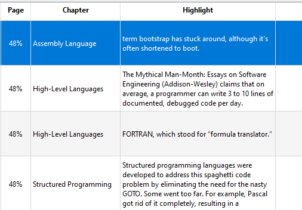
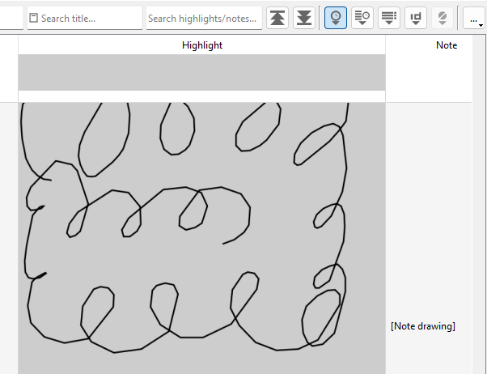
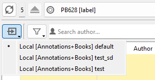

+++
title = "AVATeR v0.14 release"
date = 2024-01-04
weight = 0
aliases = []
draft = false
template = "page_software_release.html"

[taxonomies]
tags = ["AVATeR"]

[extra]
toc = true
screenshots = ["avater-screenshot-0.14-1.png"]

+++
[AVATeR](/software/avater/) v0.14 introduces Kobo and Sony annotation support. The HTML export received various fixes, and sort-by-date was made the default again. 

<!-- more -->

## Details

Read on for additional details.

#### Exporter fixes (HTML mostly)
HTML tables now again have border lines, colorcodes were fixed and deleted annotations are marked again as such. 

#### Date sorting the default again

Sort-by-date is now default again. A possible fix exists for the [PocketBook clock issues](/posts/2023/2023-12-16-pocketbook_clock_fix/); and the sort-on-ID mode turned out unsuitable for Kobo and Sony readers. 

#### CheckDB note for PocketBooks
The checkDB tool now distinguishes between errors and less important warnings. Errors for local databases are now indicates as well (fixed).

_Note on Windows with PocketBook e-readers, the v14.0 checkDB tool may report a database error for the `FTSBooks_*` tables: the error being that the check is being run in read-only mode. For now, the tool is kept read-only, with these 'errors' being counted as warnings._ [^1]

\
\

#### Kobo annotation support added
AVATeR v0.14 imports Kobo annotations for readers with recent fimware. It works well enough. A chapter title column was added to the viewer (hidden by default).Note Kepub support is considered experimental and may break. 

Notes for the current release:
- kepub support works, but is considered experimental
- page numbers are replaced with progress percentages
- chapter information is available in a new column, hidden by default. Inclusion in non-CSV exports is a todo.
- For full details see the [AVATeR device compatibility](/software/avater/pages/compatibility#kobo) page.

If something else doesn't work, just drop a line via e-mail or the forum.

Note AVATeR currently support 2017-2022/23 era databases. Newer firmware updates may introduce changes, with AVATeR's current release schedule and deployment setup being not that well suited to this - a solution for this is in the works.

\
\

#### Sony Reader annotations support added
AVATeR v0.14 also imports Sony e-Reader annotations. So yes, the "2000s called", but implementing Sony support turned out usefull (and sometimes cumbersome, like getting drawn notes to work, as shown below). Overall, it works quite well, but has some gotchas listed below.

By the way, for Sony Readers, preferably use a memory card to store your books (and thus annotations), and enable the Local Mirror for the card device (...for "an optimal experience"). The most important limitations are: 

- Annotation texts are currently limited to 200 characters (what is available in the DB, fixing this is doable, but complex).
- One main or card database can be accessed at a time. Alternatively, use a local (database) mirror setup (next item)
- The Local Mirror is limited to syncing just one (main/card) storage, and any associated data 
- On Windows, after accepting the connection on the reader screen, you may need to re-scan the devices to detect the databases.
- full details on the [AVATeR device compatibility](/software/avater/pages/compatibility#sony) page.

#### Profile/Source menu moved

The device profile/database selection menu was moved under the new Sources button, on the top-left of the viewer (previously located in the top menu "profiles"). Right now this benefits mainly Sony e-reader users.

#### Extra HTTPS checks for the updater
The update check has been hardened somewhat, limiting it to HTTPS connections (after this [blog post](https://www.volkerkrause.eu/2022/11/19/qt-qnetworkaccessmanager-best-practices.html). Note it fetches a text file with a version number as commented on [here (Bonus heading)](/posts/2023/2023-10-16-avater_updater_fix/#bonus-how-the-update-check-works): 

####  Windows library updates
Qt was updated to 6.6.1 and Libzip to 1.10.1.

## Next release

A few things are planned for v0.15.

First are some additional internal improvents of the backup tool. Some are implemented already, like the file iterator - this also opens up the option for adding KOReader support eventually. 

Some minor bugs and glitches need addressing. Note filtering was mentioned waaaay back; the new PocketBook translation note feature hasn't been extensively looked into yet; lastly, Kobo chapter titles need to be included in the annotation exports. And Mac support will be extensively investigated this time.

<!--
Lastly, the Debian 10 Buster release may be scrapped. The intent is to move to C++ 20 for technical improvements (compile time mostly, using modules) and its unclear if it is properly supported.
-->

---

\
[^1]: Note the mentioned tables contain little data, and appear to be used for (text) searching, with data mainly referring to book titles. For a Lux 5 at least, allowing a checkDB run with read/write permissions did remove the warning, and didn't modify the file dates. Even so, the tool is kept read-only for safety reasons.

