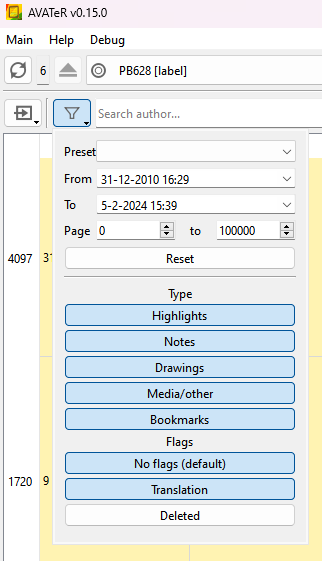
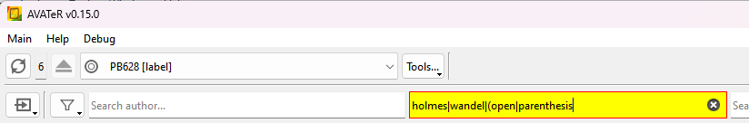
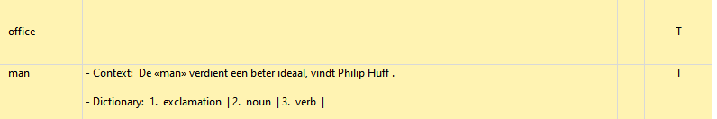
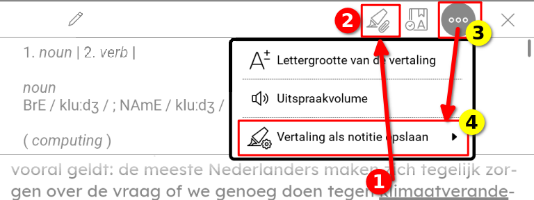

+++
title = "AVATeR v0.15 release"
date = 2024-02-09
weight = 0
aliases = []
draft = false
template = "page_software_release.html"

[taxonomies]
tags = ["AVATeR"]

[extra]
toc = true
screenshots = ["avater-screenshot-0.15-1.png"]

# 0=no prio, green; 1=low prio, yellow; 2=high prio, red
remarks = [[1, "Windows EXE installer has been deprecated in favour of the MSI installer. If needed, drop a message."],[0, "Windows Qt5 version added"]]

+++

[AVATeR](/software/avater/) v0.15 collects minor fixes and usability improvements: HTML+markdown export fixes, annotation type filtering, regex improvements and PocketBook translation support, amongst others.

<!-- more -->

## Details

### More export fixes

The HTML exporter now again substitutes linebreaks, and some HTML compliancy issues were fixed. 

The Markdown export now better deals with special characters - it's still a quick fix (ignores title and author fields for one), until a more extensive overhaul can be made.

### Added annotation type filters

Annotations can now be filtered on type (highlight, note, media, etc) and special features (deleted, translation, etc.), from the filter pop-up menu.

- Note that showing 'regular' annotations requires selecting the 'no flag' for technical reasons. This will be automatically selected upon unchecking all flags.

### Improved regex filtering

The search fields for author and title now also support  regular expressions. Invalid regexes are now indicated as well. 

- Complex things like lookahead searches work, but YMMV, due to line-breaks and double spaces. 
- Text parentheses also need to be escaped in the search query - so some additional work is still required.
- Used are Perl regular expressions, with flags `/s /m` enabled (resp. dot matches newline, multiline matching). 

### Remember text filter settings on device switch

Text filters (author, title, etc.) are now retained when switching between devices. This can be toggled from the viewer menu.

### Added Export media to clipboard HTML (experimental)

While usefull, support for clipboard HTML can be spotty: 
- HTML images (screenshots) are accepted by most applications, including MS Office, but few image editors
- SVG drawing support is rarer, mainly LibreOffice and Thunderbird. 

A future version will export bitmaps for increased compatibility, likely impacting image quality and size (foremost).

### Improved translation support (PocketBook)

Annotations geared towards translations (PB firmware 6.7+) are now handled better. 

If the e-reader is configured to store additional translation-related data (more on this later), this data will now be shown in the note column. Using bold typing or highlighting is doable - for now we stick to plain text.

With regard to filtering: a 'translation' is just a regular highlight (no data) or a note (with additional data stored). Hence they were viewable in previous version, minus the context.

To mark a _translation_ highlight/note on the PB e-reader, open the dictionary on a word (1) and use the highlighter icon (2). To configure storing of additional data like context, open the dot menu (3), and then the options menu (4), as shown below:

## Next release

Planned changes have been forwarded to v0.16, avoiding rushing in large changes. A new todo is improving image caching for drawings and screenshots.

\
[^2]: One accessible reference is https://www.geeksforgeeks.org/perl-regex-cheat-sheet/
