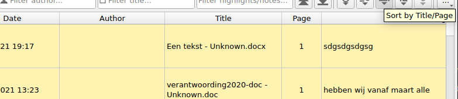
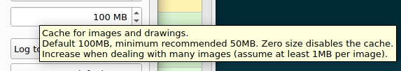
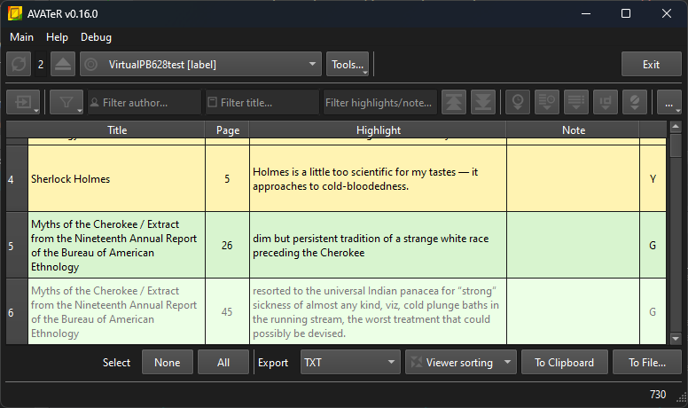

+++
title = "AVATeR v0.16 release"
date = 2024-07-27
weight = 0
aliases = []
draft = false
template = "page_software_release.html"

[taxonomies]
tags = ["AVATeR"]

[extra]
toc = true
screenshots = ["avater-screenshot-0.16-1.png"]
remarks = [[0, "Fedora 40 build added"], [1, "Windows Qt5 build will be added later"]]

+++

[AVATeR](/software/avater/) v0.16 fixes bugs with PB sorting and Local Mirror enabling, amongst others; adds image caching; improves darkmode support (Windows mainly) together with other internal changes.

<!-- more -->

## Details

Read on for additional details.

### PocketBook sorting bug fixed

For PocketBooks, titles with an empty author field weren't sorted properly, collecting at the top. This regression was due to adding Kobo and Sony support earlier.

_If upgrading isn't possible: click in the table header to manually sort columns, first by date (or page) and next by title._

### Rare local mirror enabling/syncing bug
In certain situations on Windows, a newly enabled LM wouldn't sync (the reload popup doesn't appear). Another device scan (F5) would solve this, but it's conceivable that LM syncing on startup could also fail due to this.

While LM handling was already simplified, incorrect device ordering caused the sync to target an incomplete LM source.

### Added image caching for drawings (PocketBook and Sony)

Displayed bitmap images are now cached. This mainly avoids drawings (vector SVGs) getting converted to bitmaps over and over. At worst this could halt the program momentarily when scrolling.

- Cache size is configurable under _Settings > Advanced_ (hover the mousecursor over the input field for more info). Note stored bitmaps can be large, being likely stored uncompressed and with higher (redundant) color depths by default, so be liberal whenever increasing the cache size.

### Improved darkmode support (Windows mainly)
Darkmode support was improved, mainly for Windows 11. For Linux the situation is less straightforward and under investigation, but it may benefit as well (one can try themes like `Adwaita-Dark` and `kvantum`, though these don't provide 100% coverage[^0]).

- GUI icons will be kept at 60% grey for now to simplify things. The main nag being the device connection state icons, where in dark mode the 'faded' unmounted items show up brighter.
- export support is another topic. Currently default HTML textcolors aren't touched. Allowing customized stylesheets is another option.

This was pursued after Qt 6.7 on Windows 11 defaults to the 'windows11' Qt style[^1]. Checking out darkmode was the next step. En route, a Qt bug was discovered and reported for this style, where table text color wasn't adjusted properly. Hence, AVATeR Windows builds using Qt 6.7.2 or earlier, will force usage of the generic Qt "fusion" style.

### Minor optimizations

- Annotation models were accidentally created twice, when switching sources. As data loading occurs in a separate stage, so this could go unnoticed. 

- Aforementioned models are now also sorted during creation, while redundant filtering calls were prevented. With very high annotation counts, this might provide considerable gains.

### Other changes
- PocketBook Color 3 detection was added. AFAIK, a generic Linux Foundation VID is now used (unless we've been had), that is oft used for USB hubs. Given AVATeR scans only 'block' devices, no problems are expected. And if so, let us know :-)
- the sorting mode and export sorting mode are stored with new variable names. This affects switching between v0.16 and any earlier versions.

### Internal changes (development)
There were a ton of internal changes: the CMake config was cleaned up, compile flags were added, and 'circular' header references were reduced to a minimum[^2]. Along the way, there were the usual hiccups: VCPKG and library configurations getting swamped, Windows boot issues, exploring new libraries and other stuff.

## Next release

A few things are planned for v0.17:

- Some exporter changes. Adding sorting case sensitivity is one: for this the exporter will switch to using the annotation model sorting modes. This is a step-up towards moving the annotation table out of the 'mainwindow' code; with the future option of having multiple tabs. Lastly, Kobo chapter exports be included as well. 

- Backup tool internal improvements. Some are implemented already, like the file iterator - as may be mentioned, this opens up the option for adding KOReader support eventually. 

<!--
- For Windows, AVATeR preference and data folder may be moved into the user home directory. When restoring a Windows install, these are lost in their current locations; and likely also be ignored whenever a backup is made.
-->
- Mac support will be evaluated late 2024 or early 2025. There's 'surplus cash' (though little from the rare AVATeR donations), so stay tuned[^4].

---

[^0]: One telltale is the spacing between top menu items, which initially looked weird.
[^1]: Force a style by appending i.e. `-style Fusion` when invoking AVATeR from the shell/CLI.
[^2]: whack-a-mole with #includes. Use forward declarations whenever possible in headers. As an aside, the C++ Modules alternative looks enticing, but support currently seems iffy. 
[^4]: still loathing the soldered memory on the 8GB base model: to be remedied by a 'mere' 200 currency tokens =/
