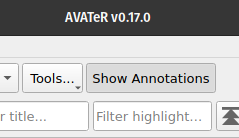
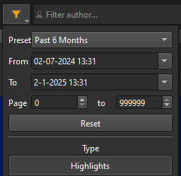
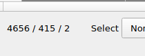

+++
title = "AVATeR v0.17 release"
date = 2025-01-19
weight = 0
aliases = []
draft = false
template = "page_software_release.html"

[taxonomies]
tags = ["AVATeR"]

[extra]
toc = true
screenshots = ["avater-screenshot-0.17-1.png"]
remarks = []

+++

[AVATeR](/software/avater/) v0.17 fixes a ton of minor bugs, mainly with filtering on date/page, and includes smaller improvements. Internally, the annotation viewer code was separated out, improving the code-base and allowing future additions.

<!-- more -->

## Details

Read on for additional details.

### Toggling the annotation viewer

The annotation viewer can now be hidden from the UI, purging the viewer from memory. This represents a step-up towards implementing multiple-tab support. By default the viewer will always be shown.

### Annotation filtering improvements

Fixed were many issues with filtering on date and/or page using the pop-up widget. 

- Kobo: filtering on page/progress/percentages didn't work previously.
- On startup restore any date/page filters - provided the previously selected device is present.
- Addressed were QOL issues, such as filter presets limiting the minimal 'FromDate'.

### Annotation counter reworked

The annotation counter now indicates the total, filtered and selected annotations. The selection count has the caveat of relying on a mouseclick signal, so YMMV.

### Restore manual sorting on startup

For manual sorting, the column selected in the previous session is now restored on startup (for the same device). One caveat is that subsequent sortings have a chained, combined effect (i.e. first sorting on column X followed by Y, as opposed to just sorting on Y, has different outcomes), that isn't easily replicated between sessions [^1].

Nevertheless sorting appears replicable (or deterministic) - for any 'tied' (similar) entries like author or title, Qt reverts to ordering using the internal row index (a numerical ID).

### Other changes/remarks
- "Settings" was moved to a new "Settings" topmenu entry.
- Start-up scans are now better handled, avoiding loading annotations for two devices in a row (if applicable). 
- Redundant sorting was prevented during model creation, noticeable with many (2000+) annotations.
- The annotation viewer code now exists as a separate entity, improving the code-base and maintainability. This entailed some extra work, as -inevitable- one encounters previous shortcuts and oversights. We managed it in the end :-). This change makes it easier to add other 'viewers', one interesting challenge being written annotations in documents. We'll see how that turns out eventually.

## Next release

We now have access to a Mac (Silicon or M* CPU) and a UHD screen, so expect developments in these areas. For one, Windows text on UHD resolutions looks fuzzy.

Things planned for v0.17 (re the exporter and backup tool) still stand. KOReader support is still on the map. The Windows Qt5 build will also be reinvestigated.

---

[^1]: For those interested, there exist a custom [QProxySortModel](https://github.com/dimkanovikov/MultisortTableView) that stores previously sorted columns.
