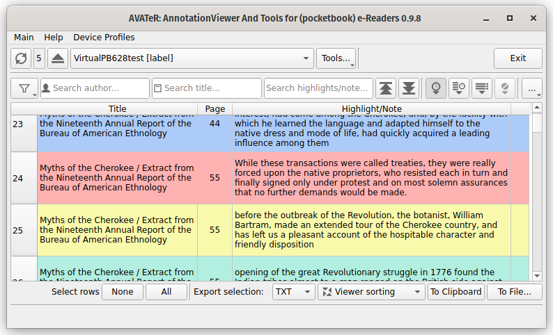

+++
title = "AVATeR v0.9.8 release"
date = 2022-05-28
weight = 0
aliases = ["/posts/2022/avater-release-0-9-8/"]
template = "page_software_release.html"

[taxonomies]
tags = ["AVATeR"]

[extra]
toc = true
screenshots = ["AVATER-screenshot-098-1.png"]

+++
[AVATeR](/software/avater/) v0.9.8 introduces highlight colors, a sticky selection mode, and various fixes. 

<!-- more -->

## Details

Read on for additional details.

### Changes
- **New: show highlight colors**
\
Can be set to color full rows, single columns or be disabled alltogether[^1]. A text abbreviation can be shown for bad lighting conditions or visually impaired users. [see viewer menu]

- **New: sticky annotation selection option**
\
Avoids pressing the control- and/or shift-key for selecting multiple annotations. [see viewer menu]

### Improvements

- **Improved: row resizing when scrolling**
\
When scrolling, 'row bouncing' has been strongly reduced compared to 0.9.7. For scroll-to-bottom 'misalignments' are now prevented after filtering or sorting on date.

- **Improved: Windows USB handling**
\
    - Device detection checks single device
\
Now only the changed device is checked (as does the Linux version), instead of relying on a full device scan. 

    - Replaced USB/mount time delays with retry loops
\

- **Improved: Local mirror removal when syncing**
\
If active local mirrors are disabled in devices.conf, they are removed during a device scan (F5). Previously this required a restart.

### Fixes

- **Fixed: Removed deadlock situation with disabled device monitor**
\
When the device monitor was disabled, a device scan (F5) that detected a missing USB device (and issued it's removal) would trigger a deadlock, causing an infinite wait[^2].

- **Fixed: URLs for website/updating**
\
Redirects will be kept in place for older versions.

- Various minor changes/fixes

## Future changes
- 0.9.9 is planned for June/July. 
- Linux release is coming, as a Flatpack and/or a Debian installer.

---

[^1]: Showing highlight colors was suggested by Huwaetzel

[^2]: Re deadlock: as of 0.9.8, with a disabled device monitor, a 'Device scan' that detects a missing USB device will no longer issue removal (internal/GUI) of that device. The registered connection state will be altered, blocking device-related tools from starting, as was the original design (<= 0.9.6).

