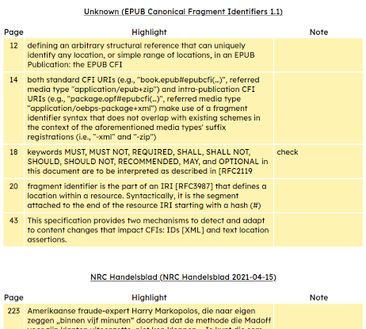
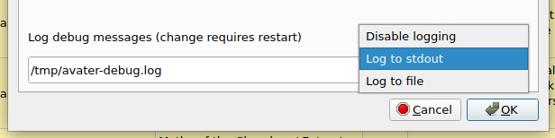

+++
title = "AVATeR v0.9.9 release"
date = 2022-07-22
weight = 0
aliases = ["/posts/2022/avater-release-0-9-9/"]
template = "page_software_release.html"

[taxonomies]
tags = ["AVATeR"]

[extra]
toc = true

+++
[AVATeR](/software/avater/) v0.9.9 improves annotation exports and debug logging.

<!-- more -->

## Details
The exporter was internally reworked to use substitution variables, opening the way for user-customizable export formats.

This release also marks over a year of AVATeR, but that is a story for another time...

### Changes
- **Improved: HTML export** \
Visual lay-out was improved, and annotation colors are now shown. The HTML source includes CSS classes for manual/future styling.



- **Improved: CSV export** \
Additional columns are exported with date and color information. The date string now follows a generic format (European day-month-year; i.e. 21-07-2022 21:02:23).
\
\
The current headers are:
```DateRaw;Date;Author;Title;Page;Highlights;Notes;Color;ColorHTML```.
Where ```DateRaw``` is the epoch date (if available), ```Date``` its string notation, and ```ColorHTML``` the hex RGB color notation.

- **Improved: set debugmode from GUI, added logfile option to CLI** \
The debugmode (to either stdout or file), can now be set from the GUI prefs as well. A CLI logfile option was added also.
\
_Note: CLI arguments take precedence over (GUI) preference settings (and disabling the latter)._



- **Added: Raw SQL export option** \
Exports raw SQL data for selected annotations, useful for debugging purposes.
Enable by using either debug mode (stdout/file). This is an experimental feature.

- **Windows: updated libraries**
\
Windows Qt libraries were updated from 6.2.1 to 6.2.4 (LTS).

- **Minor changes** Annotion colors now use RGB (no transparancy); button/field heights were made more uniform


## Future changes
The intention is to make the next release v1.0. Interesting topics include sorting exports using color within titles, and implementing profile selection.
